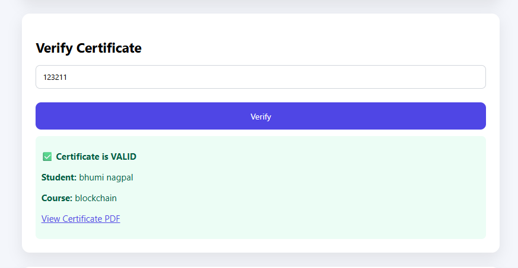
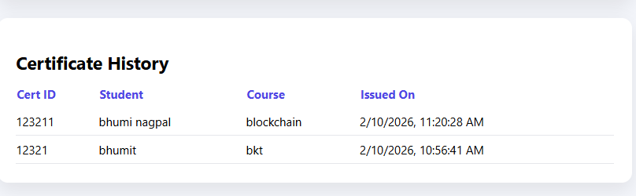

# Blockchain Certificate Issuance & Verification DApp

A full-stack blockchain-based application to issue, verify, and track academic certificates securely.

## 🚀 Features
- Issue certificates on Ethereum blockchain
- Verify certificate authenticity using Certificate ID
- Decentralized storage using IPFS (PDF upload)
- MetaMask wallet integration
- Certificate issuance history
- Tamper-proof verification

## 🛠 Tech Stack
- Solidity
- Hardhat
- Ethereum
- React.js
- Ethers.js
- IPFS (Pinata)
- MetaMask

## 📸 Screenshots

### Issue Certificate


### Verify Certificate


### Certificate History



## ⚙️ How to Run Locally

```bash
npm install
npx hardhat node
npx hardhat run scripts/deploy.js --network localhost
cd frontend
npm start
